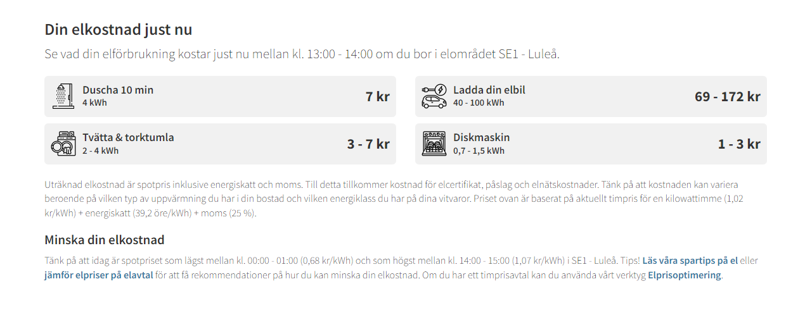
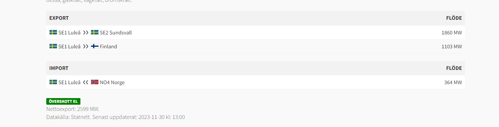
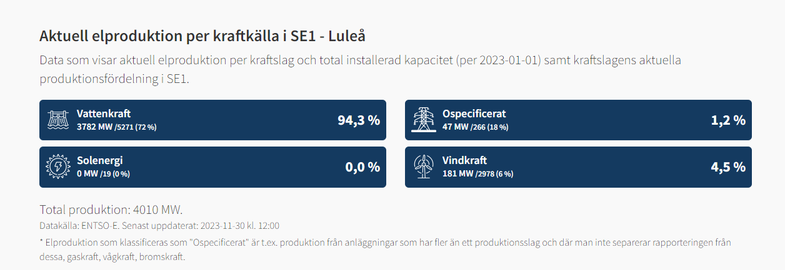

# Node-Harjoituksia
Web-palvelinten toimintaan liittyviä esimerkkejä toteutettuna Node.js kirjaston avulla

## TODOs
- UI 👨‍💻
    1. ✅Redo navbar menu (on dropdown)
        - Make it look nicer..
    2. ✅Fix the homepage on smaller screens
        - Make it look nicer

        NOTE: This happened because height for that div was set to "full", hence why it stretched.
    3. ✅Finish the General Page!!
    4. ✅Fix General page on mobile

- MIXED 🔀
    1. ✅Finish the Spot Price page
        - Figure out what goes in the blue div in Spot Price page
        - Finish the other boxes
    2. 🟩Correctly translate
        - Translate all texts
        - Translate all buttons, links chart/table elements & icons..etc.
    3. 🟩Create the Weather Page
    4. 🟩Create Settings Page
    5. 🟩Create dark/light theme
    6. 🟩Update the Weather Data in General page
    7. 🟩Add "Kipuraja" for user to set
    8. 🟩Create & train AI price prediction

  
## Ideas to add

* Show what specific things cost right now

* Export import data

* Amount per source
